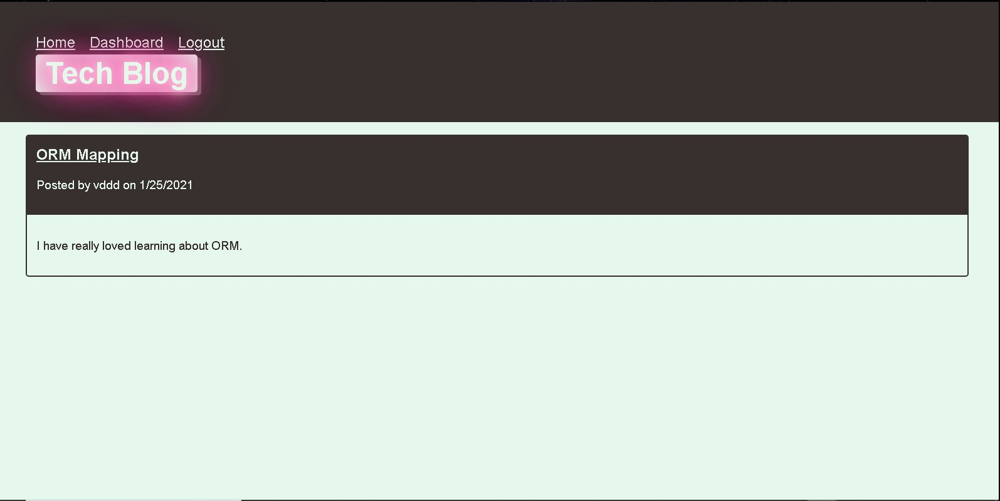
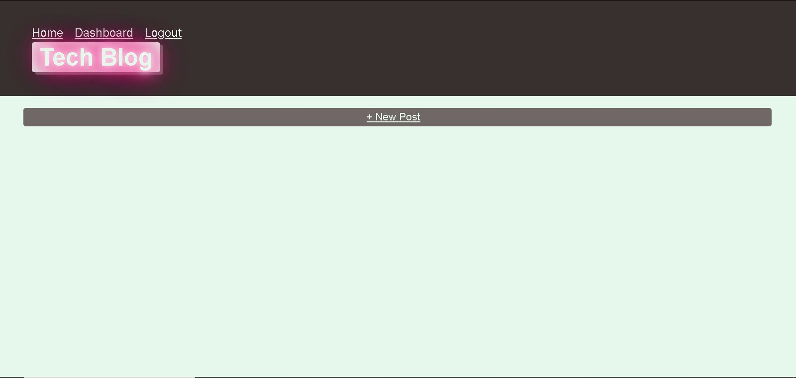

# MVC-Tech-blog

## Description 
CMS style tech blog that allows anyone to expresss their thoughts and feelings about technology.

## Built With
NODE.JS
MYSQL
Javascript
HTML 
CSS
## Installation 
* Express.
* MySql
* Handlebars
* Sequelize
* DotEnv
* Path
* Express Sessions
## LICENCE 
MIT 

## Website

## Usage
Must be logged in by clicking on the user name , you will be automatically logged in and then can navigate to dashboard where you create your posts and comments, then after 
that you can log out.
## CONTRIBUTER
vd2c@valdo
